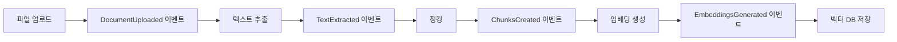
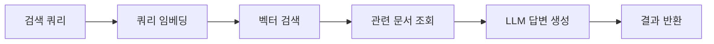

# 기술 스택 및 컨텍스트

## 기술 스택

### Backend Framework
- **FastAPI**: 비동기 웹 프레임워크
- **Python 3.12**: 메인 개발 언어
- **Pydantic**: 데이터 검증 및 설정 관리
- **uvicorn**: ASGI 서버

### 데이터베이스
- **MongoDB**: 문서 메타데이터 및 원본 저장
- **Qdrant**: 벡터 임베딩 저장 및 검색

### 메시지 큐
- **Apache Kafka**: 이벤트 기반 아키텍처
- **Zookeeper**: Kafka 클러스터 관리

### 외부 API
- **OpenAI API**: 임베딩 생성 및 LLM 답변 생성

### 개발 도구
- **Poetry**: Python 패키지 관리자
- **Docker & Docker Compose**: 컨테이너화
- **pytest**: 테스트 프레임워크
- **pytest-asyncio**: 비동기 테스트 지원
- **black, isort, mypy**: 코드 품질 도구

### 핵심 라이브러리
- **PyPDF2/pdfplumber**: PDF 텍스트 추출
- **python-docx**: DOCX 파일 처리
- **email**: 이메일 파싱
- **motor**: MongoDB 비동기 드라이버
- **qdrant-client**: Qdrant 클라이언트
- **aiokafka**: Kafka 비동기 클라이언트
- **openai**: OpenAI API 클라이언트
- **structlog**: 구조화된 로깅
- **dependency-injector**: 의존성 주입 컨테이너

## 아키텍처 패턴

### 핵심 패턴
- **이벤트 기반 아키텍처**: 모듈 간 느슨한 결합
- **Port/Adapter 패턴**: 외부 시스템 연동 추상화
- **유즈케이스 패턴**: 복잡한 비즈니스 로직 처리
- **Repository 패턴**: 데이터 접근 추상화
- **의존성 주입**: 모듈 간 결합도 최소화

### 모듈 구조
```
src/
├── core/                    # 공통 핵심 기능
│   ├── config.py           # 설정 관리
│   ├── dependencies.py     # 의존성 주입
│   ├── exceptions.py       # 커스텀 예외
│   └── logging.py          # 로깅 설정
├── infrastructure/         # 인프라 계층
│   ├── database/           # MongoDB 연결
│   ├── vectordb/           # Qdrant 연결
│   └── messaging/          # Kafka 연결
├── modules/                # 비즈니스 모듈
│   ├── ingest/             # 문서 수집 모듈
│   ├── process/            # 문서 처리 모듈
│   ├── search/             # 검색 모듈
│   └── monitor/            # 모니터링 모듈
├── api/                    # REST API 계층
│   └── v1/                 # API v1
└── utils/                  # 공통 유틸리티
```

### 각 모듈 내부 구조
```
module/
├── domain/                 # 도메인 계층
│   ├── entities.py         # 엔티티
│   └── value_objects.py    # 값 객체
├── application/            # 애플리케이션 계층
│   ├── ports/              # 포트 인터페이스
│   ├── use_cases/          # 유즈케이스
│   └── services/           # 도메인 서비스
├── infrastructure/         # 인프라 계층
│   ├── repositories/       # 리포지토리 구현
│   └── adapters/           # 어댑터 구현
└── interfaces/             # 인터페이스 계층
    └── rest/               # REST API
```

## 구현된 모듈

### 1. Ingest Module (문서 수집)
- **기능**: 파일 업로드, 이메일 파싱, 문서 상태 관리
- **이벤트**: DocumentUploaded, EmailParsed
- **저장소**: MongoDB (문서 메타데이터)

### 2. Process Module (문서 처리)
- **기능**: 텍스트 추출, 청킹, 임베딩 생성, 중복 제거
- **이벤트**: TextExtracted, ChunksCreated, EmbeddingsGenerated
- **저장소**: MongoDB (청크), Qdrant (임베딩)

### 3. Search Module (검색)
- **기능**: 벡터 검색, LLM 답변 생성
- **외부 API**: OpenAI (임베딩, GPT)
- **저장소**: Qdrant (벡터 검색)

### 4. Monitor Module (모니터링)
- **기능**: 메트릭 수집, 알림 관리, 헬스체크
- **알림**: 이메일 알림
- **저장소**: MongoDB (메트릭, 알림)

## 이벤트 흐름

### 문서 처리 파이프라인


### 검색 흐름


## 환경 설정

### 개발 환경
- **파일**: .env.development
- **데이터베이스**: 로컬 MongoDB, Qdrant
- **메시징**: 로컬 Kafka
- **로그 레벨**: DEBUG

### 테스트 환경
- **파일**: .env.test (향후)
- **데이터베이스**: 테스트 전용 DB
- **Mock**: 외부 API Mock 사용

### 운영 환경
- **파일**: .env.production (향후)
- **데이터베이스**: 클러스터 구성
- **보안**: TLS, 인증 강화

## 테스트 전략

### 테스트 구조
```
test/
├── unit/                   # 단위 테스트
│   ├── test_*_domain_*.py  # 도메인 테스트
│   ├── test_*_use_cases_*.py # 유즈케이스 테스트
│   └── test_*_infrastructure_*.py # 인프라 테스트
└── integration/            # 통합 테스트
    └── test_main_app.py    # 전체 앱 테스트
```

### 테스트 커버리지
- **목표**: 80% 이상
- **현재**: 각 모듈별 단위 테스트 완료
- **도구**: pytest, pytest-asyncio, pytest-cov

## 성능 고려사항

### 현재 구현
- **비동기 처리**: FastAPI, motor, aiokafka 사용
- **이벤트 기반**: 모듈 간 비동기 통신
- **벡터 검색**: Qdrant 최적화된 검색

### 향후 최적화 계획
- **캐싱**: Redis 도입 예정
- **병렬 처리**: Worker Pool 구성
- **배치 처리**: 대용량 문서 처리 최적화
- **인덱싱**: MongoDB, Qdrant 인덱스 최적화

## 보안 고려사항

### 현재 구현
- **입력 검증**: Pydantic 스키마 검증
- **예외 처리**: 구조화된 예외 관리
- **로깅**: 민감 정보 마스킹

### 향후 보안 강화
- **인증/인가**: JWT 토큰 기반
- **API 보안**: Rate limiting, CORS 설정
- **데이터 암호화**: 민감 데이터 암호화
- **감사 로그**: 사용자 활동 추적

## 모니터링 및 관찰성

### 현재 구현
- **구조화된 로깅**: structlog 사용
- **메트릭 수집**: 자체 구현
- **헬스체크**: 시스템 상태 모니터링
- **알림**: 이메일 알림 시스템

### 향후 확장
- **메트릭 시각화**: Grafana 연동
- **분산 추적**: OpenTelemetry 도입
- **로그 집계**: ELK Stack 연동
- **알림 채널**: Slack, SMS 추가

## 배포 및 운영

### 컨테이너화
- **Docker**: 애플리케이션 컨테이너화
- **Docker Compose**: 개발 환경 구성
- **멀티스테이지 빌드**: 최적화된 이미지

### CI/CD (향후)
- **GitHub Actions**: 자동화된 빌드/테스트
- **컨테이너 레지스트리**: Docker Hub/ECR
- **배포 자동화**: Kubernetes/Docker Swarm

## 확장성 고려사항

### 수평 확장
- **마이크로서비스**: 모듈별 독립 배포 가능
- **이벤트 기반**: 서비스 간 느슨한 결합
- **상태 비저장**: 세션 상태 외부화

### 수직 확장
- **리소스 최적화**: 메모리, CPU 사용량 모니터링
- **데이터베이스 최적화**: 인덱싱, 쿼리 튜닝
- **캐싱 전략**: 다층 캐싱 구조
