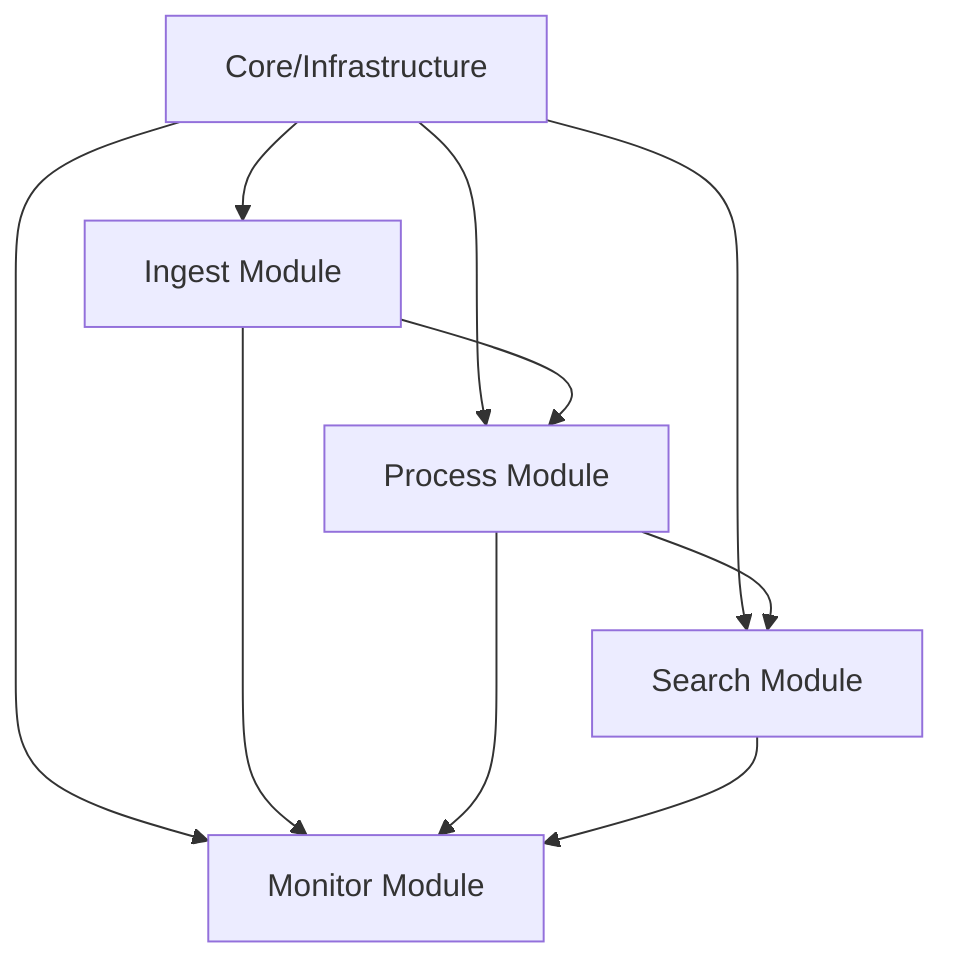

# 문서 검색 플랫폼(RAG) - 프로젝트 개발 계획서

## 목차
1. [개발 개요](#1-개발-개요)
2. [개발 단계별 작업 계획](#2-개발-단계별-작업-계획)
3. [모듈별 개발 순서](#3-모듈별-개발-순서)
4. [통합 및 테스트 계획](#4-통합-및-테스트-계획)
5. [배포 준비 계획](#5-배포-준비-계획)

## 1. 개발 개요

### 1.1 프로젝트 목표
- 문서 검색 플랫폼(RAG) 프로토타입 개발
- 이벤트 기반 아키텍처를 활용한 확장 가능한 시스템 구축
- 모듈화된 구조로 향후 마이크로서비스 전환 준비

### 1.2 개발 원칙
- 단계별 점진적 개발 (Incremental Development)
- 모듈 간 느슨한 결합 유지
- 테스트 주도 개발 (TDD) 적용
- 지속적 통합/배포 (CI/CD) 준비

### 1.3 개발 우선순위
1. **Phase 0**: 개발 환경 구축 및 기초 설정
2. **Phase 1**: 핵심 인프라 및 공통 모듈 개발
3. **Phase 2**: 비즈니스 로직 구현
4. **Phase 3**: 통합 및 최적화
5. **Phase 4**: 테스트 및 문서화

## 2. 개발 단계별 작업 계획

### Phase 0: 개발 환경 구축 (Discovery & Setup)

#### 0.1 개발 환경 설정
```yaml
작업 순서:
  1. 프로젝트 디렉토리 구조 생성
  2. Python 가상환경 설정 (venv/poetry)
  3. 의존성 관리 파일 작성 (pyproject.toml)
  4. Git 저장소 초기화 및 .gitignore 설정
  5. Pre-commit hooks 설정 (black, isort, mypy)
```

#### 0.2 인프라 환경 구축
```yaml
작업 순서:
  1. Docker 및 Docker Compose 설정
  2. MongoDB 컨테이너 구성
  3. Qdrant 벡터 DB 컨테이너 구성
  4. Kafka 및 Zookeeper 컨테이너 구성
  5. 개발용 환경 변수 파일 작성 (.env.development)
```

#### 0.3 기술 검증 (PoC)
```yaml
작업 순서:
  1. FastAPI 기본 애플리케이션 구조 검증
  2. MongoDB 연결 및 기본 CRUD 테스트
  3. Qdrant 연결 및 벡터 저장/검색 테스트
  4. Kafka 이벤트 발행/구독 테스트
  5. OpenAI API 연동 테스트
```

### Phase 1: 핵심 인프라 및 공통 모듈 개발

#### 1.1 Core 모듈 개발
```yaml
작업 순서:
  1. core/config.py - 설정 관리 클래스 구현
     - Pydantic Settings 활용
     - 환경별 설정 분리
  
  2. core/exceptions.py - 커스텀 예외 클래스 정의
     - 비즈니스 예외
     - 시스템 예외
  
  3. core/events.py - 이벤트 스키마 정의
     - 이벤트 기본 클래스
     - 도메인별 이벤트 타입
  
  4. core/logging.py - 구조화된 로깅 설정
     - structlog 설정
     - 로그 포맷터
```

#### 1.2 Infrastructure 계층 구현
```yaml
작업 순서:
  1. infrastructure/database/mongodb.py
     - MongoDB 연결 관리
     - 비동기 클라이언트 설정
     - Connection Pool 설정
  
  2. infrastructure/vectordb/qdrant_client.py
     - Qdrant 클라이언트 래퍼
     - 컬렉션 초기화
     - 인덱스 설정
  
  3. infrastructure/messaging/kafka_client.py
     - Kafka Producer 구현
     - Kafka Consumer 구현
     - 이벤트 직렬화/역직렬화
  
  4. infrastructure/cache/redis_client.py (선택)
     - Redis 클라이언트 설정
     - 캐시 관리 유틸리티
```

#### 1.3 공통 유틸리티 개발
```yaml
작업 순서:
  1. utils/id_generator.py - UUID 생성 유틸리티
  2. utils/hash.py - 텍스트 해싱 유틸리티
  3. utils/validators.py - 입력 검증 유틸리티
  4. utils/datetime.py - 날짜/시간 처리 유틸리티
```

### Phase 2: 비즈니스 로직 구현

#### 2.1 Ingest Module 개발
```yaml
작업 순서:
  1. Domain 계층
     - ingest/domain/entities.py (Document, User)
     - ingest/domain/value_objects.py (DocumentMetadata)
  
  2. Infrastructure 계층
     - ingest/infrastructure/repositories/document_repository.py
     - ingest/infrastructure/file_handler.py
  
  3. Application 계층
     - ingest/application/services/document_service.py
     - ingest/application/use_cases/parse_email.py (UC-01)
  
  4. Interface 계층
     - api/v1/documents.py (REST API 엔드포인트)
     - 파일 업로드 처리 (UC-02)
     - 이메일 파싱 처리
```

#### 2.2 Process Module 개발
```yaml
작업 순서:
  1. Domain 계층
     - process/domain/entities.py (Chunk, Embedding)
  
  2. Infrastructure 계층
     - process/infrastructure/text_extractor.py
       * PDF 텍스트 추출 구현
       * DOCX 텍스트 추출 구현
       * 기타 형식 지원
     
     - process/infrastructure/text_chunker.py
       * 문서 유형별 청킹 전략
       * 청크 크기 관리
       * 메타데이터 추가
     
     - process/infrastructure/embedding_service.py
       * OpenAI 임베딩 API 연동
       * 배치 처리 구현
  
  3. Application 계층
     - process/application/use_cases/extract_text.py (UC-04)
     - process/application/use_cases/create_chunks.py (UC-05)
     - process/application/use_cases/generate_embeddings.py (UC-06)
     - process/application/use_cases/deduplicate_chunks.py (UC-08)
  
  4. 이벤트 처리
     - process/application/event_handlers/document_processor.py
       * Kafka Consumer 구현
       * 이벤트 기반 처리 파이프라인
```

#### 2.3 Search Module 개발
```yaml
작업 순서:
  1. Domain 계층
     - search/domain/entities.py (Query, Answer)
  
  2. Port 정의
     - search/application/ports/llm_port.py
       * LLM 서비스 인터페이스
  
  3. Infrastructure 계층
     - search/infrastructure/vector_db.py
       * Qdrant 검색 구현 (UC-09)
     
     - search/infrastructure/adapters/openai_adapter.py
       * OpenAI API 어댑터
       * GPT 모델 연동
  
  4. Application 계층
     - search/application/use_cases/generate_answer.py (UC-10)
     - search/application/services/search_service.py
  
  5. Interface 계층
     - api/v1/search.py (REST API 엔드포인트)
       * 벡터 검색 API
       * 답변 생성 API
```

#### 2.4 Monitor Module 개발
```yaml
작업 순서:
  1. 메트릭 수집
     - monitor/services/metrics_collector.py
     - 처리 통계 수집 (UC-11)
  
  2. API 엔드포인트
     - api/v1/stats.py
     - 통계 조회 API
```

### Phase 3: 통합 및 최적화

#### 3.1 모듈 통합
```yaml
작업 순서:
  1. 메인 애플리케이션 구성
     - main.py 작성
     - FastAPI 앱 초기화
     - 라우터 등록
     - 미들웨어 설정
  
  2. 의존성 주입 설정
     - dependencies.py
     - 서비스 팩토리 구현
  
  3. 이벤트 흐름 통합
     - 이벤트 핸들러 등록
     - 이벤트 라우팅 설정
```

#### 3.2 성능 최적화
```yaml
작업 순서:
  1. 병렬 처리 구현
     - Worker Pool 설정
     - 배치 처리 최적화
  
  2. 캐싱 구현
     - 검색 결과 캐싱
     - 임베딩 캐싱
  
  3. 데이터베이스 최적화
     - 인덱스 생성
     - 쿼리 최적화
```

#### 3.3 에러 처리 및 복구
```yaml
작업 순서:
  1. 전역 에러 핸들러
     - 예외 처리 미들웨어
     - 에러 응답 표준화
  
  2. 재시도 로직
     - 외부 API 호출 재시도
     - 이벤트 처리 재시도
  
  3. 서킷 브레이커
     - 외부 서비스 장애 대응
```

### Phase 4: 테스트 및 문서화

#### 4.1 테스트 구현
```yaml
작업 순서:
  1. 단위 테스트
     - 각 모듈별 유닛 테스트
     - Mock 객체 활용
     - 테스트 커버리지 80% 이상
  
  2. 통합 테스트
     - API 엔드포인트 테스트
     - 이벤트 흐름 테스트
     - 데이터베이스 연동 테스트
  
  3. E2E 테스트
     - 전체 파이프라인 테스트
     - 실제 파일 업로드 → 검색 시나리오
```

#### 4.2 문서화
```yaml
작업 순서:
  1. API 문서
     - OpenAPI 스펙 생성
     - Swagger UI 설정
  
  2. 개발자 문서
     - README.md 작성
     - 설치 가이드
     - 설정 가이드
  
  3. 아키텍처 문서
     - 시스템 다이어그램
     - 데이터 흐름도
     - API 시퀀스 다이어그램
```

## 3. 모듈별 개발 순서

### 3.1 개발 의존성 그래프


### 3.2 상세 개발 순서
1. **Core/Infrastructure** (필수 선행)
2. **Ingest Module** (독립 개발 가능)
3. **Process Module** (Ingest 완료 후)
4. **Search Module** (Process와 병행 가능)
5. **Monitor Module** (다른 모듈과 병행 가능)

## 4. 통합 및 테스트 계획

### 4.1 단계별 통합
```yaml
통합 순서:
  1. Ingest → Kafka 이벤트 발행 테스트
  2. Process → Kafka 이벤트 구독 테스트
  3. Process → Vector DB 저장 테스트
  4. Search → Vector DB 검색 테스트
  5. 전체 파이프라인 통합 테스트
```

### 4.2 테스트 시나리오
```yaml
주요 시나리오:
  1. PDF 업로드 → 텍스트 추출 → 청킹 → 임베딩 → 검색
  2. 이메일 파싱 → 첨부파일 처리 → 검색
  3. 대용량 문서 처리 성능 테스트
  4. 동시 요청 처리 테스트
  5. 장애 복구 시나리오 테스트
```

## 5. 배포 준비 계획

### 5.1 컨테이너화
```yaml
작업 순서:
  1. Dockerfile 작성
     - 멀티스테이지 빌드
     - 최소 이미지 크기
  
  2. Docker Compose 구성
     - 개발 환경 설정
     - 테스트 환경 설정
  
  3. 환경별 설정
     - 개발/테스트/운영 분리
```

### 5.2 CI/CD 파이프라인
```yaml
작업 순서:
  1. GitHub Actions 설정
     - 자동 테스트
     - 코드 품질 검사
  
  2. 빌드 자동화
     - Docker 이미지 빌드
     - 버전 태깅
  
  3. 배포 준비
     - 헬스체크 엔드포인트
     - 그레이스풀 셧다운
```

### 5.3 모니터링 준비
```yaml
작업 순서:
  1. 로그 수집 설정
     - 중앙 집중식 로깅
  
  2. 메트릭 수집
     - Prometheus 메트릭
  
  3. 알림 설정
     - 에러 알림
     - 성능 임계치 알림
```

---

## 부록: 개발 체크리스트

### Phase 0 체크리스트
- [ ] 프로젝트 구조 생성
- [ ] 개발 환경 설정
- [ ] 인프라 컨테이너 구성
- [ ] 기술 PoC 완료
- [ ] ADR 문서 작성

### Phase 1 체크리스트
- [ ] Core 모듈 구현
- [ ] Infrastructure 계층 구현
- [ ] 공통 유틸리티 구현
- [ ] 단위 테스트 작성

### Phase 2 체크리스트
- [ ] Ingest Module 구현
- [ ] Process Module 구현
- [ ] Search Module 구현
- [ ] Monitor Module 구현
- [ ] 모듈별 테스트 완료

### Phase 3 체크리스트
- [ ] 모듈 통합 완료
- [ ] 성능 최적화 적용
- [ ] 에러 처리 구현
- [ ] 통합 테스트 완료

### Phase 4 체크리스트
- [ ] 전체 테스트 커버리지 80% 이상
- [ ] API 문서 완성
- [ ] 개발자 가이드 작성
- [ ] 배포 준비 완료

---

**참고**: 본 개발 계획서는 체계적인 작업 순서를 제시하며, 실제 개발 과정에서는 병렬 작업이 가능한 부분을 고려하여 효율적으로 진행할 수 있습니다.
